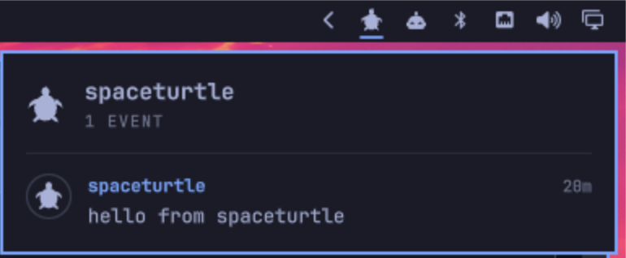

# omarchy-relay-feed

An [Omarchy](https://omarchy.org/) shell plugin that puts your [TOON](https://github.com/toon-protocol/toon_cli) agent node's relay in the bar: a turtle that opens a feed of the social events stored on the relay, with a profile page for each author.



## What it does

- **Feed.** Notes, replies, reposts, reactions, comments and long-form posts from the relay, newest first, each with its author's picture and name.
- **Profile page.** Click a picture or a name: picture, name, about, website, ILP address, connector URL and public key (as `npub1…`), then that author's events. Click a value to copy all of it.
- **Follow.** On someone else's profile, a button adds them to or removes them from your agent identity's follow list (NIP-02, kind 3) on your relay.
- **Counters.** Followers and following on every profile; on your own, also how many hold a subscription to your relay's live feed (`–` while the relay does not sell it).
- **Bar icon.** Dimmed while the relay is not running; an accent dot when events arrived since you last looked.

It follows the Omarchy theme: colours, font, border and popup placement all come from the shell.

## Requirements

- Omarchy with the Quickshell-based shell (`omarchy plugin` commands).
- A running agent node: [`toon`](https://github.com/toon-protocol/toon_cli) on `PATH` or in `~/.local/bin`, and `toon up`.
- `jq`, and `wl-copy` for copying.

## Install

```sh
omarchy plugin add https://github.com/toon-protocol/omarchy-relay-feed.git --enable
```

Move it with `omarchy bar move toon.relay-feed --section right`, or drag it in the bar.

## Use

| Input | Does |
| --- | --- |
| Left click | Open or close the popup |
| Middle click | Refresh now |
| Up / Down | Scroll |
| Enter | Refresh |
| Esc, Left | Back from a profile; Esc again closes |

## Settings

On the plugin's entry in `~/.config/omarchy/shell.json`:

```json
{ "id": "toon.relay-feed", "interval": 30, "limit": 40, "icon": 2 }
```

| Setting | Default | Meaning |
| --- | --- | --- |
| `interval` | `30` | Seconds between refreshes, at least 5 |
| `limit` | `40` | The most events to fetch |
| `icon` | `1` | Which turtle drawing, 1 to 5 |
| `iconPreview` | `false` | Show all five drawings in the popup, to choose one |

## How it gets its data

The plugin runs no service of its own. Every refresh, `relay-events` asks `toon status` for the relay's read address (it changes on each `toon up`) and reads the relay with `toon event query`, which costs nothing.

Two things open the wallet's keystore, and so need its passphrase:

- reading your agent identity's public key, once; it is then cached in `~/.cache/toon-relay-feed/identity`,
- publishing your follow list when you press Follow.

The scripts use `TOON_PASSPHRASE_FILE` or `TOON_PASSPHRASE` if the shell's environment has one, and otherwise fall back to `~/.config/toon/passphrase`, the path the `toon` guide suggests. Without a passphrase the feed still works; your own profile is not recognised and there is no Follow button.

A profile is untrusted input: everything from it is rendered as plain text, a picture is loaded only from an `http(s)` URL, and copied values are passed to `wl-copy` as an argument, never through a shell.

`ILP` and `Node` on the profile page come from two fields that are not part of NIP-01, `ilp_address` and `connector`, which a TOON agent node may put in its kind 0 profile to say where it is paid.

## Files

| File | |
| --- | --- |
| `manifest.json` | The plugin's manifest |
| `Panel.qml` | The bar button and the popup |
| `Avatar.qml`, `TurtleIcon.qml` | Profile picture and the icon |
| `relay-events` | Prints the relay's events, profiles and follow lists as one JSON document |
| `relay-follow` | Adds a key to, or removes it from, the follow list |
| `relay-lib` | Shared by the two scripts |

After editing QML in an installed copy, run `omarchy restart shell`: the shell caches loaded components.

## License

[MIT](LICENSE)
